# Dynamic Hedger

## Prérequis
- Installer Docker
- Python 3.11.4
- Un IDE : VS Code

## Consultation rapide des résultats
- Notre appli frontend est déployé avec Streamlit et disponible ici : [https://opti-hedge-front.streamlit.app/](https://opti-hedge-front.streamlit.app/)
- Notre appli backend FastAPI est déployé avec Render  et disponible ici : [https://opti-hedge-backend.onrender.com]
- Notre github (ce dépôt) : [https://github.com/McKingN/PROJET_DDEFI_2025/](https://github.com/McKingN/PROJET_DDEFI_2025/)


NB : Consultez le fichier [DEVELOPER.md](DEVELOPER.md) pour comprendre l'architecture du projet.

Après exécution (ci-dessous), accéder à la page d'accueil de l'application via [localhost:5000](http://localhost:5000) (ou votre IP locale).
La documentation Swagger est accessible via cette adresse également [(localhost:5000)](http://localhost:5000). Nous y avons expliqué l'utilité de chaque endpoint.

## Commandes d'exécution

Pour créer une image Docker de l'application Dynamic Hedger, placez-vous dans le dossier du projet et exécutez :

```bash
docker build -t dynamic-hedger-api:latest .
```

Pour démarrer l'application et ses dépendances dans un conteneur Docker :

```bash
docker-compose up -d
```

Pour arrêter les services :

```bash
docker-compose down -v
```

Pour supprimer toutes les images et volumes entre deux compilations, retirez l'option `-v` :

```bash
docker-compose down
```

## Description du Modèle

Dynamic Hedger est une application permettant d'obtenir les quantités d'actifs sous-jacents et d'actifs sans risque pour constituer un portefeuille de réplication afin de couvrir une position directionnelle sur un call européen.

Le modèle utilise un réseau de neurones LSTM (Long Short-Term Memory) pour optimiser les stratégies de couverture d'options financières. Son objectif principal est de **minimiser le risque** de la stratégie de couverture en optimisant le CVaR (Conditional Value at Risk) plutôt que la variance.

## Avantages par rapport au modèle Black-Scholes
- **Meilleure performance dans des marchés non-gaussiens** : le modèle LSTM capture des dynamiques de marché plus complexes et non linéaires.
- **Adaptation aux frictions du marché** : il prend en compte les coûts de transaction et autres contraintes réelles du marché.
- **Optimisation directe de la métrique de risque** : le modèle optimise directement le CVaR, offrant ainsi une meilleure gestion du risque.
- **Absence d'hypothèses restrictives** : contrairement à Black-Scholes, il ne nécessite pas d'hypothèses sur la distribution des rendements.

## Architecture du Modèle
Le modèle repose sur un réseau LSTM multicouche qui reçoit en entrée l'historique des prix et génère en sortie les ratios de couverture optimaux (deltas) pour ajuster dynamiquement le portefeuille de réplication.

## Monitoring et Visualisation
Accéder à la page de monitoring Grafana via [localhost:3000](http://localhost:3000) (ou votre IP locale).


```
Utiliser identifiant : admin, mot de passe : grafana pour l'authentification.
```

### Exemples de visualisation des métriques sur Grafana


Accéder à la page de monitoring Prometheus via [localhost:9090](http://localhost:9090) (ou votre IP locale).

### Exemples de visualisation des données sur Prometheus
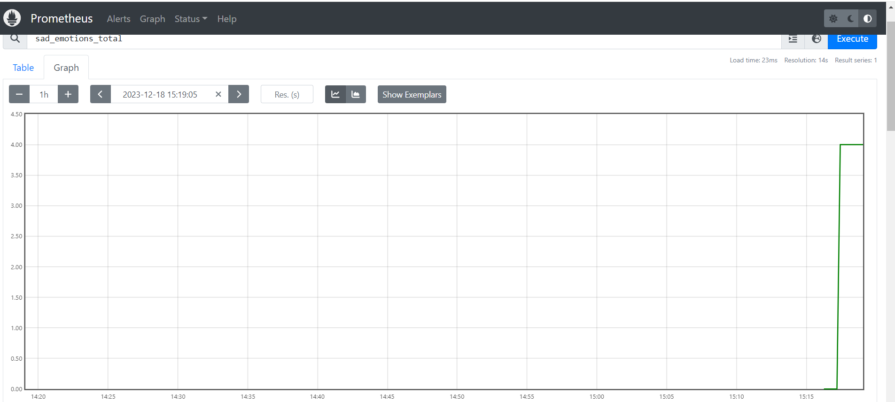
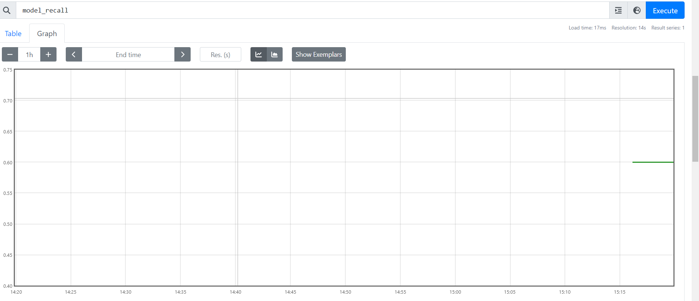
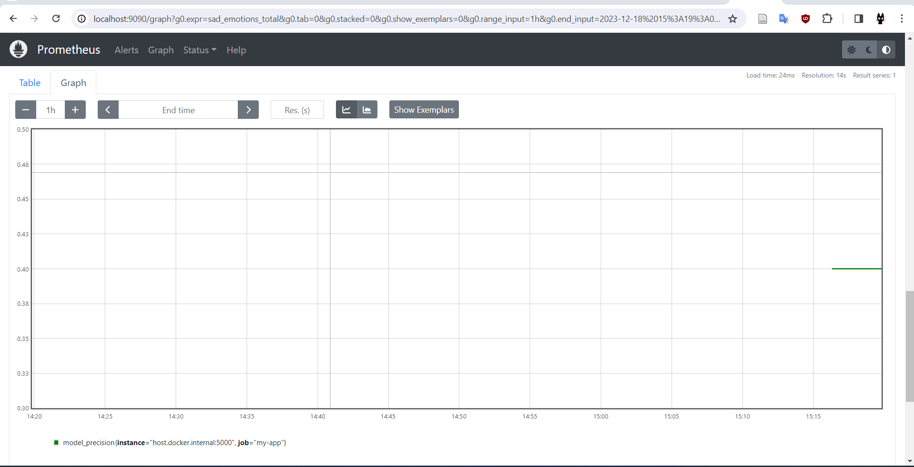


Voici ci-dessous quelques images de l'évolution des métriques scrapées sur grafana.
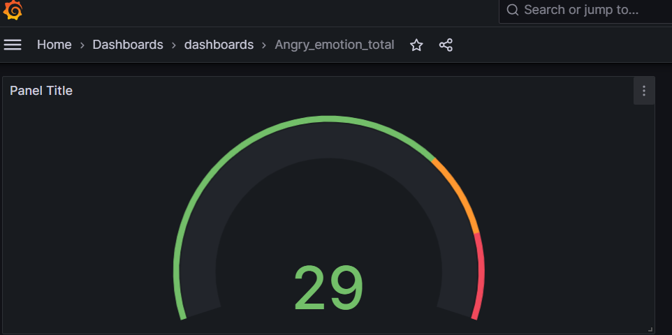
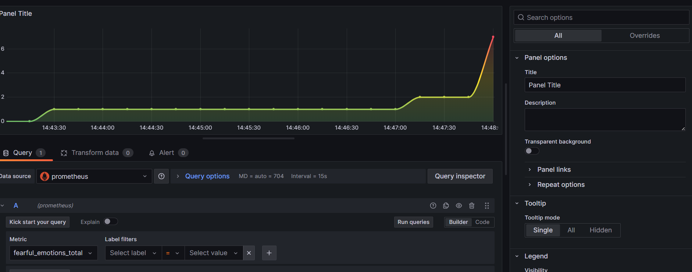
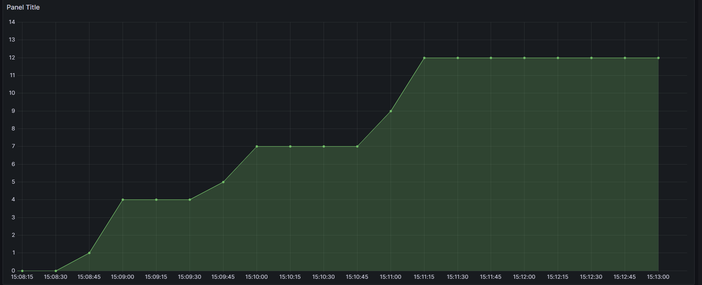
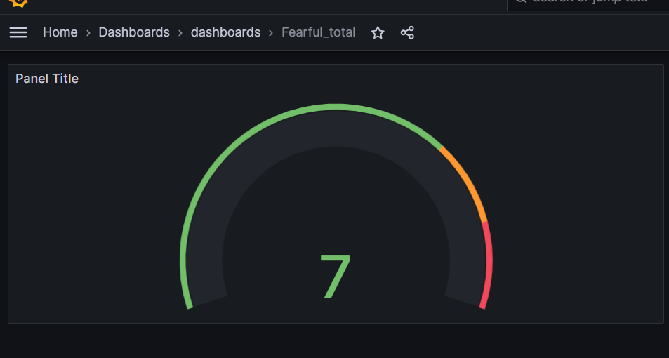
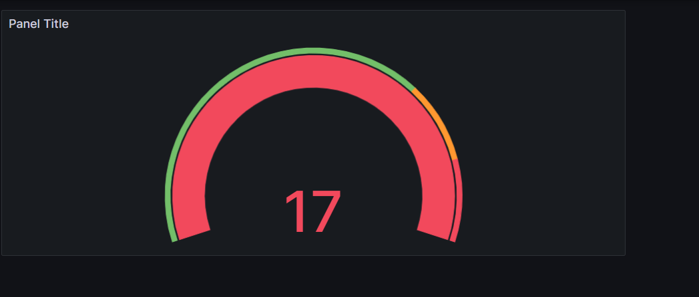
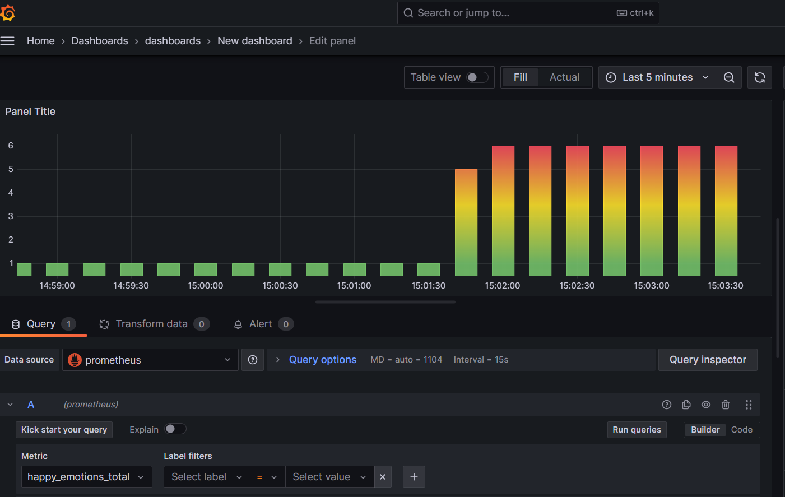
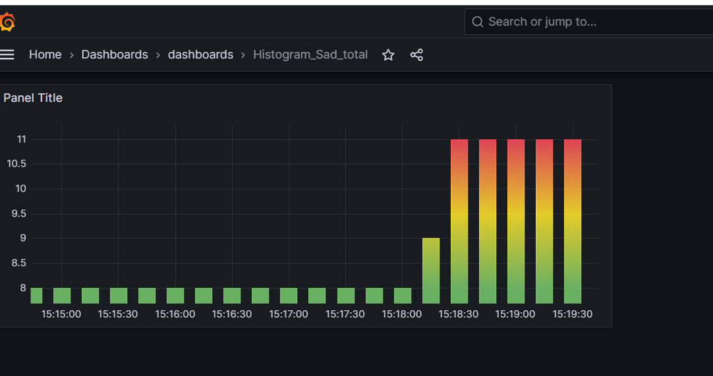
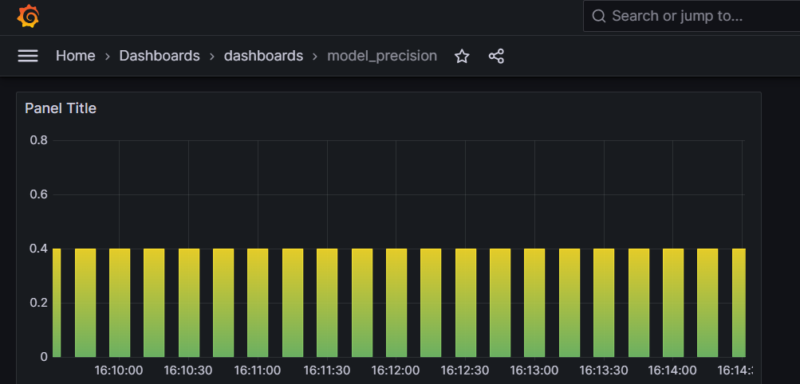
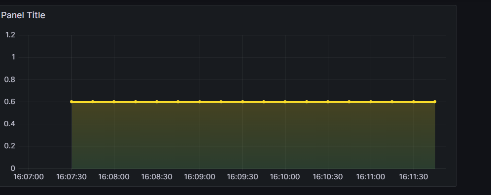
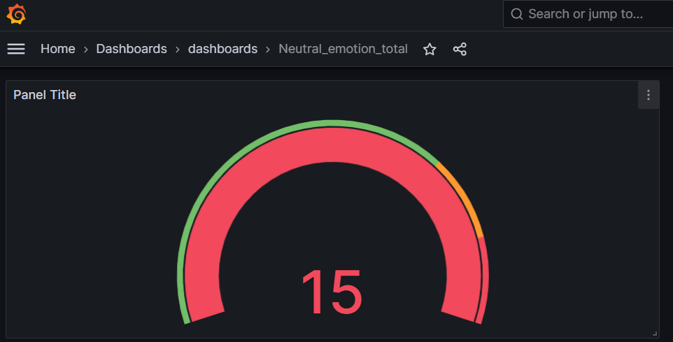
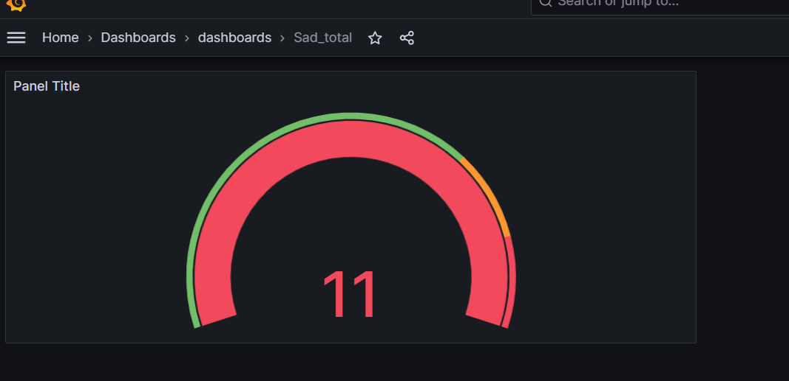
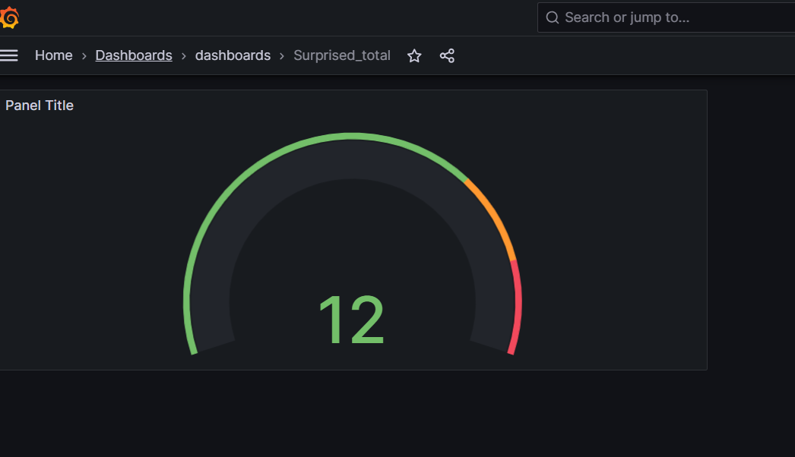


